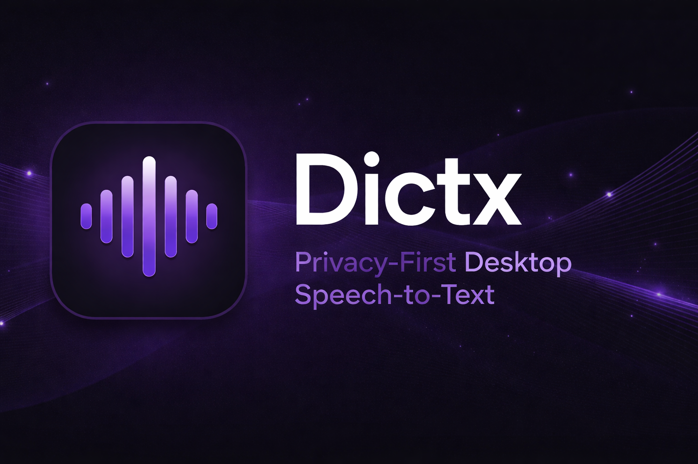

<p align="center">
  
</p>

<p align="center">
  <strong>Privacy-first desktop speech-to-text that runs entirely on your machine.</strong>
</p>

<p align="center">
  <a href="https://github.com/0xNyk/dictx/releases"></a>
  &nbsp;
  <a href="https://buy.splitlabs.io"></a>
</p>

<p align="center">
  <a href="LICENSE"></a>
  <a href="https://github.com/0xNyk/dictx/stargazers"></a>
</p>

<p align="center">
  <a href="#installation">Installation</a> &middot;
  <a href="#how-it-works">How It Works</a> &middot;
  <a href="#obsidian-integration">Obsidian Integration</a> &middot;
  <a href="#cli">CLI</a> &middot;
  <a href="BUILD.md">Build from Source</a> &middot;
  <a href="CONTRIBUTING.md">Contributing</a>
</p>

---

> **Free and open source.** Dictx is GPL-3.0 licensed — you can build it from source with full functionality. [Buy Dictx Pro](https://buy.splitlabs.io) ($29 one-time) for a signed binary, auto-updates, and to support development.

Dictx is a cross-platform desktop application for speech transcription. Press a shortcut, speak, and your words appear in any text field — no cloud, no API keys, no data leaving your computer.

Built with [Tauri](https://tauri.app) (Rust + React/TypeScript). Forked from [Handy](https://github.com/cjpais/Handy) by cjpais.

## Features

- **100% Local** — All processing happens on-device. Zero network requests for transcription.
- **Multiple Models** — Choose from Whisper (Small/Medium/Turbo/Large) with GPU acceleration or Parakeet V3 for CPU-optimized inference.
- **Voice Activity Detection** — Automatic silence filtering with Silero VAD.
- **Obsidian Integration** — Export transcriptions as markdown notes with YAML frontmatter, daily note appending, and configurable folder structure.
- **Post-Processing** — Optional LLM-based cleanup, summarization, or reformatting of transcriptions.
- **Cross-Platform** — macOS (Intel + Apple Silicon), Windows (x64), Linux (x64).
- **CLI Control** — Toggle recording, cancel operations, and configure startup behavior from the command line.
- **i18n** — Localized in 17 languages.

## Installation

Download the latest release for your platform from the [Releases page](https://github.com/0xNyk/dictx/releases).

| Platform | Format               |
| -------- | -------------------- |
| macOS    | `.dmg`               |
| Windows  | `.msi`               |
| Linux    | `.AppImage` / `.deb` |

After installation:

1. Launch Dictx and grant the required permissions (microphone, accessibility on macOS)
2. Select and download a transcription model
3. Configure your keyboard shortcut in Settings
4. Start transcribing

> To build from source, see [BUILD.md](BUILD.md).

## How It Works

1. **Press** a configurable keyboard shortcut (toggle or push-to-talk)
2. **Speak** — Dictx records and filters silence in real-time
3. **Release** — audio is processed locally through your chosen model
4. **Done** — transcribed text is pasted into the active text field

### Models

| Model          | Type | Speed    | Accuracy  | Requirements                      |
| -------------- | ---- | -------- | --------- | --------------------------------- |
| Whisper Small  | GPU  | Fast     | Good      | GPU recommended                   |
| Whisper Medium | GPU  | Moderate | Better    | GPU recommended                   |
| Whisper Turbo  | GPU  | Fast     | Very Good | GPU recommended                   |
| Whisper Large  | GPU  | Slower   | Best      | GPU required                      |
| Parakeet V3    | CPU  | Fast     | Very Good | CPU only, auto language detection |

## Obsidian Integration

Dictx can automatically export every transcription to your Obsidian vault. Configure in **Settings > Advanced > Obsidian Integration**:

- **Vault Path** — Select your Obsidian vault root folder
- **Subfolder** — Target folder within your vault (default: `voice-notes`)
- **Append to Daily Note** — Add a timestamped reference to today's daily note

Exported notes include YAML frontmatter (timestamp, duration, word count, source) and optionally embed the raw transcription in a collapsible callout when post-processing is enabled.

## CLI

Dictx supports command-line flags for remote control and startup configuration.

**Control a running instance:**

```bash
dictx --toggle-transcription    # Start/stop recording
dictx --toggle-post-process     # Start/stop with post-processing
dictx --cancel                  # Cancel current operation
```

**Startup options:**

```bash
dictx --start-hidden            # Launch without showing the window
dictx --no-tray                 # Launch without system tray icon
dictx --debug                   # Enable verbose logging
```

Combine flags for autostart scenarios: `dictx --start-hidden --no-tray`

> **macOS:** When installed as an app bundle, invoke the binary directly:
>
> ```bash
> /Applications/Dictx.app/Contents/MacOS/Dictx --toggle-transcription
> ```

## Architecture

```
src-tauri/src/          Rust backend
├── lib.rs              App entry point, Tauri setup
├── managers/           Core logic (audio, model, transcription, history)
├── audio_toolkit/      Audio recording, resampling, VAD
├── commands/           Tauri command handlers
├── shortcut.rs         Global keyboard shortcuts
├── settings.rs         Settings management
├── tray.rs             System tray
└── obsidian_export.rs  Obsidian vault integration

src/                    React/TypeScript frontend
├── App.tsx             Main component
├── components/         UI (settings, onboarding, sidebar)
├── stores/             Zustand state management
├── hooks/              React hooks
└── i18n/               17 language translations
```

**Key dependencies:** `whisper-rs`, `transcribe-rs` (Parakeet), `cpal`, `vad-rs`, `rdev`, `rubato`

## Platform Notes

### macOS

- Metal acceleration for Whisper models
- Requires Accessibility and Microphone permissions
- Debug mode: `Cmd+Shift+D`

### Windows

- Vulkan acceleration for Whisper models
- Debug mode: `Ctrl+Shift+D`

### Linux

Requires a text input tool for reliable typing:

| Display Server | Tool      | Install                    |
| -------------- | --------- | -------------------------- |
| X11            | `xdotool` | `sudo apt install xdotool` |
| Wayland        | `wtype`   | `sudo apt install wtype`   |
| Both           | `dotool`  | `sudo apt install dotool`  |

- Recording overlay disabled by default (compositors may treat it as active window)
- If issues occur, try: `WEBKIT_DISABLE_DMABUF_RENDERER=1 dictx`
- Wayland shortcuts must be configured through your DE using [CLI flags](#cli)

## Troubleshooting

### Manual Model Installation

If you're behind a proxy or firewall, models can be installed manually. Download the model files and place them in the app data directory:

| Platform | Path                                                   |
| -------- | ------------------------------------------------------ |
| macOS    | `~/Library/Application Support/com.0xnyk.dictx/`       |
| Windows  | `C:\Users\{username}\AppData\Roaming\com.0xnyk.dictx\` |
| Linux    | `~/.config/com.0xnyk.dictx/`                           |

## Contributing

Contributions are welcome. See [CONTRIBUTING.md](CONTRIBUTING.md) for guidelines.

## License

GPL-3.0. See [LICENSE](LICENSE) for details and [NOTICE](NOTICE) for attribution and license history.

Originally created by [cjpais](https://github.com/cjpais) as [Handy](https://github.com/cjpais/Handy) (MIT). Forked and extended by [0xNyk](https://github.com/0xNyk) under GPL-3.0.

## Acknowledgments

- [Handy](https://github.com/cjpais/Handy) by cjpais — the upstream project
- [Whisper](https://github.com/openai/whisper) by OpenAI — speech recognition models
- [whisper.cpp](https://github.com/ggerganov/whisper.cpp) / [ggml](https://github.com/ggerganov/ggml) — cross-platform inference
- [Silero VAD](https://github.com/snakers4/silero-vad) — voice activity detection
- [Tauri](https://tauri.app) — desktop application framework
